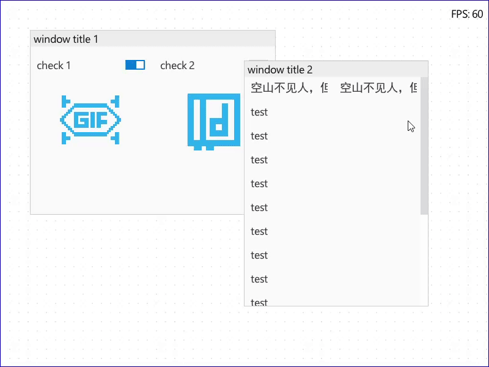

# UI

An immediate-mode UI library implemented in C using Direct3D 11.

## Roadmap

- command list [x]
- zindex [x]
- window [x]
- layout [x]
- text rendering [x]
- clip [x]
- scrollbar [x]
- hot reload [x]
- controls: 
  - scrollable window [x]
  - label [x]
  - animated checkbox [x]
  - image [x]
  - animated gif [x]
- popup window [ ]
- wordwrapped text [ ]
- more... [ ]

## Demo

```c
static void process_frame(UI_Context* ctx)
{
    ui_begin(ctx);
    {
        // window 1
        ui_begin_window(ctx, L"window title 1", ui_rect(50, 50, 400, 300));
        {
            ui_layout_row(ctx, 2, 50);
            {
                static int check[] = { 1, 0 };
                ui_checkbox(ctx, L"check 1", &check[0]);
                if (ui_checkbox(ctx, L"check 2", &check[1]))
                {
                    ui_gif(ctx, "C:/Users/niko1/repos/ui/assets/test.gif");
                    ui_gif(ctx, "C:/Users/niko1/repos/ui/assets/test2.gif");
                }
            }
            ui_layout_row(ctx, 2, 100);
            {
                ui_image(ctx, "C:/Users/niko1/repos/ui/assets/test.png");
                ui_image(ctx, "C:/Users/niko1/repos/ui/assets/test2.png");
            }
        }
        ui_end_window(ctx);
        // window 2
        ui_begin_window(ctx, L"window title 2", ui_rect(400, 100, 300, 400));
        {
            ui_layout_row(ctx, 2, 24);
            {
                ui_label(ctx, L"空山不见人，但闻人语响");
                ui_label(ctx, L"空山不见人，但闻人语响");
            }
            ui_layout_row(ctx, 1, 24);
            {
                for (int i = 0; i < 15; i++)
                    ui_label(ctx, L"test");
            }
        }
        ui_end_window(ctx);
    }
    ui_end(ctx);
}
```



## Dependency

- [stb_truetype.h](https://github.com/nothings/stb/blob/master/stb_truetype.h)

## Licenses

This project followed [microui](https://github.com/rxi/microui)'s idea, which is an open-source UI library licensed under the [MIT license](https://github.com/rxi/microui?tab=MIT-1-ov-file).
